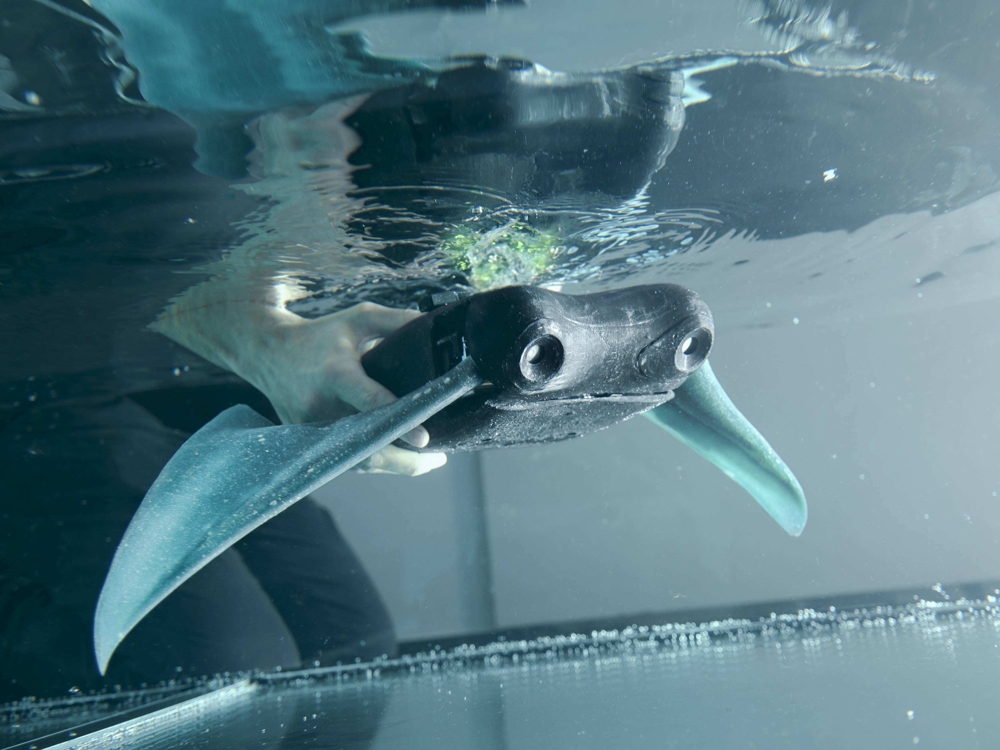
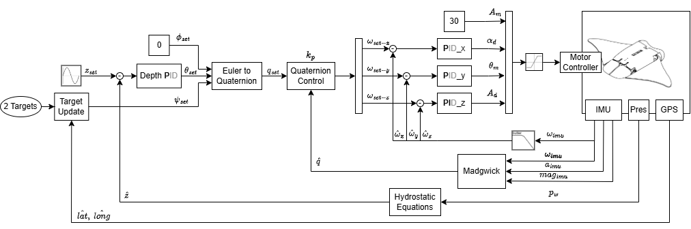
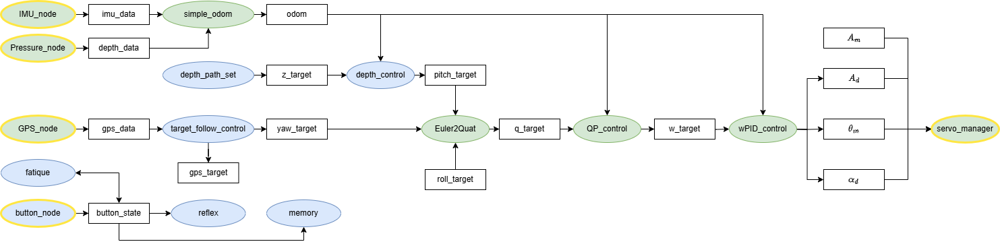
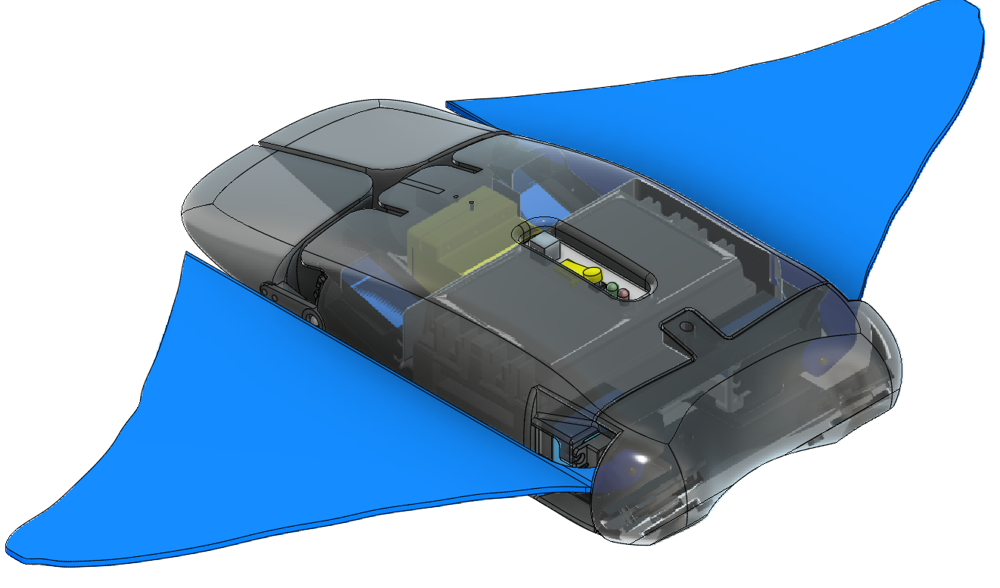
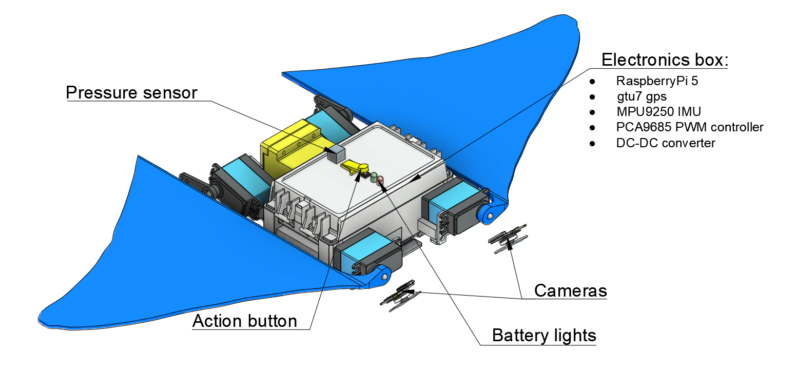
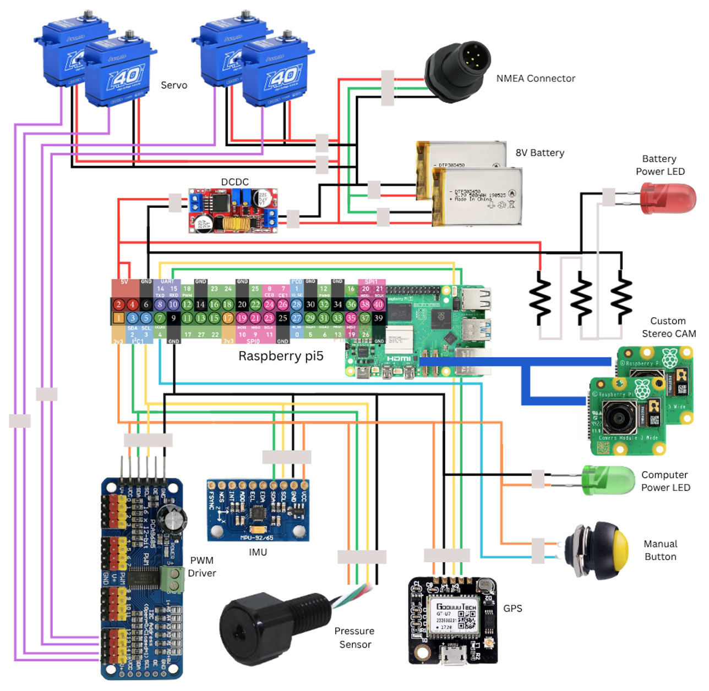

# MAUI — moves

Software stack for a cownose-ray-inspired AUV with flexible pectoral fins and simple 6-DOF closed-loop navigation.  

[T. Scudeletti, G. Bianchi, S. Arrigoni, S. Cinquemani, and F. Braghin, ‘From fin dynamics to navigation control: A simplified framework for batoid-inspired underwater locomotion’, Ocean Engineering, vol. 365, p. 127077, Sep. 2026](https://doi.org/10.1016/j.oceaneng.2026.127077)


<p align="center">
  
</p>


---

## Overview

MAUI is a bio-inspired AUV that mimics the locomotion of a cownose ray, propelling itself through oscillating flexible silicone pectoral fins and steering with two caudal rudder fins. The key contribution of this project is a **fully onboard, model-free 6-DOF closed-loop navigation system** operating in open water without any external tracking — using only an IMU, a depth sensor, and GPS for resurfacing.

The control architecture is cascaded: a Madgwick-filter attitude estimator feeds a quaternion-based attitude regulator, which is wrapped by a depth PID and an outer GPS-assisted heading controller. All control logic runs in **ROS 2 Jazzy** inside a Docker container, making the software OS-independent and deployable identically on the robot (Raspberry Pi 5) and on a development machine.

Forward speed is not closed-loop controlled — it is set open-loop via the pectoral fin stroke amplitude `A_m`. The default value is configured in [`ros2_ws/src/maui_brain/cerebellum/config/BMF.yaml`](ros2_ws/src/maui_brain/cerebellum/config/BMF.yaml) under `start_wing`. Increasing `A_m` raises thrust; decreasing it reduces speed.

### Control Architecture

<p align="center">
  
</p>

### ROS 2 Node Graph

<p align="center">
  
</p>

---

## Software Structure

The ROS 2 packages are organized under `maui_brain`, with each package taking inspiration from a functional region of the brain:

| Package | Brain Region | Role |
|---|---|---|
| `brain_stem` | Brain Stem | Launches and configures the low-level hardware drivers (IMU, pressure, PWM, GPS) |
| `cerebellum` | Cerebellum | Attitude, angular-rate and depth controllers |
| `frontal_lobe` | Frontal Lobe | High-level navigation and mission planning |
| `parietal_lobe` | Parietal Lobe | State estimation and sensor fusion |
| `temporal_lobe` | Temporal Lobe | Reflex, memory and fatigue: button events, rosbag recording, mission timeout |
| `occipital_lobe` | Occipital Lobe | Camera interface and visual processing |

The top-level `maui` package holds the main launch files that orchestrate all subsystems. Hardware drivers for I²C sensors live as standalone packages (`mpu9250`, `ms5837`, `gtu7_gps_comm`, `pwm_pca9685`).

## Repository Structure

```
Maui/
├── docker/
│   ├── raspi_ros2/         # Docker setup for deployment on Raspberry Pi 5
│   └── maui_emulator/      # Docker setup for development on a personal computer
├── raspiOs_setup/
│   ├── maui_setup.sh       # Step-by-step Raspberry Pi OS setup reference
│   ├── maui_auto_setup.sh  # Fully automated Raspberry Pi OS setup
│   ├── useful_terminal.sh  # Cheat sheet of handy Docker / ROS 2 / hardware commands
│   └── raspi_api_interface/# Python HTTP servers that expose the Pi cameras to the container
├── ros2_ws/src/
│   ├── maui/               # Top-level package with main launch files
│   ├── maui_brain/         # Control logic packages (see table above)
│   ├── mpu9250/            # IMU driver
│   ├── ms5837/             # Pressure/depth sensor driver
│   ├── gtu7_gps_comm/      # GPS driver
│   └── pwm_pca9685/        # PWM controller driver
├── tools/                  # Offline utilities (e.g. rosbag covariance rewriting)
└── images/                 # Diagrams and schematics
```

---

### CAD Model

<table border="0" cellspacing="10" cellpadding="0" align="center">
<tr>
<td align="center"><br/><sub>Perspective view</sub></td>
<td align="center"><br/><sub>Component layout</sub></td>
</tr>
</table>

## Hardware

- Raspberry Pi 5
- PCA9685 PWM controller
- MPU9250 9-axis IMU + magnetometer
- BlueRobotics MS5837-02BA depth/pressure sensor
- GTU7 GPS receiver
- 2× Raspberry Pi CAM 3 (CSI strip connector)
- 4× PowerHD 40 kg waterproof servos (pectoral fins)
- 2× servo-actuated caudal rudder fins
- DC-DC converter (2S LiPo → 5 V regulated)

<p align="center">
  
</p>

## Camera Bridge

The Raspberry Pi cameras connect via CSI strip connectors and are not directly accessible from inside the Docker container. A Flask-based HTTP server (`raspiOs_setup/raspi_api_interface/fast_cameras_server.py`) runs on the host OS and exposes both cameras simultaneously over a local HTTP endpoint that the container consumes.

> **Network note:** the camera server listens on `0.0.0.0:5000` without authentication, and the containers run with `network_mode: host` and `privileged: true` for hardware access. This is intended for a robot on a private network or its own hotspot — anyone on the same network can read the camera stream. Do not expose the robot on untrusted networks.

---

## Prerequisites

- [Docker](https://docs.docker.com/get-docker/) with the Compose plugin
- Git

---

## Deployment

### On the Robot (Raspberry Pi 5)

Two setup scripts are provided in [`raspiOs_setup/`](raspiOs_setup/):

| Script | Purpose |
|---|---|
| [`maui_setup.sh`](raspiOs_setup/maui_setup.sh) | Step-by-step reference — run commands individually, useful for understanding each step or troubleshooting |
| [`maui_auto_setup.sh`](raspiOs_setup/maui_auto_setup.sh) | Fully automated — runs end-to-end on a fresh Raspberry Pi OS (Bookworm) install without any interactive prompts |

**Automated setup (recommended for a fresh Pi):**

```bash
bash raspiOs_setup/maui_auto_setup.sh
```

The script handles: system update, I2C/UART activation, SSH, Docker install, gpsd configuration, camera bridge dependencies, repo clone, Docker image build, and systemd autostart for the camera bridge. The container itself restarts automatically on boot via Docker's `restart: unless-stopped` policy.

**What runs at boot (after setup + reboot):**

1. **Docker daemon** starts automatically (systemd service installed with Docker)
2. **Camera bridge** starts automatically (`maui-camera.service`) — exposes CSI cameras over HTTP
3. **MAUI container** restarts automatically (Docker restart policy) — builds the workspace and launches `circle_path.launch.py`

**Attaching to the running container:**

```bash
docker exec -it maui_jazzy bash
```

**Changing the default launch file** or understanding all available missions and tests:
→ See [`ros2_ws/src/maui/README.md`](ros2_ws/src/maui/README.md)

### Development on a Personal Computer

Detailed instructions: [`docker/maui_emulator/`](docker/maui_emulator/) *(README coming soon)*

```bash
# 1. (Optional) By default the repo's ros2_ws is mounted. To use another
#    workspace, set PROJECT_DIRECTORY=/path/to/your/ros2_ws in docker/maui_emulator/.env

# 2. Build and start the container
cd docker/maui_emulator
docker compose up -d

# 3. Attach and work
docker exec -it maui_jazzy bash
```

> An X server (e.g., VcXsrv on Windows, XQuartz on macOS) is required for GUI tools such as RViz, for Foxglove the bridge should work without.

---

## Connecting to the Robot

Setup the raspberry pi on the same Wi-Fi network as your development machine. The robot will acquire an IP address via DHCP. You can find the IP address by checking your router's connected devices or using a network scanning tool (e.g., `nmap`).

---

## License

The repository as a whole is released under the [MIT License](LICENSE). The ROS 2 packages under `ros2_ws/src/` are individually licensed under Apache-2.0 (see the `LICENSE` file in each package), with the exceptions below.

### Third-party code

Some packages include code derived from other open-source projects. The original notices are kept in each package's license file:

| Package | Derived from | License |
|---|---|---|
| `mpu9250` | [hideakitai/MPU9250](https://github.com/hideakitai/MPU9250) — Hideaki Tai | MIT |
| `ms5837` | [BlueRobotics MS5837 Library](https://github.com/bluerobotics/BlueRobotics_MS5837_Library) — BlueRobotics | MIT |
| `pwm_pca9685` | [dheera/ros-pwm-pca9685](https://github.com/dheera/ros-pwm-pca9685) — Dheera Venkatraman | BSD 3-Clause (whole package) |
| `parietal_lobe` (EKF configs) | [robot_localization](https://github.com/cra-ros-pkg/robot_localization) — Charles River Analytics | BSD 3-Clause |
